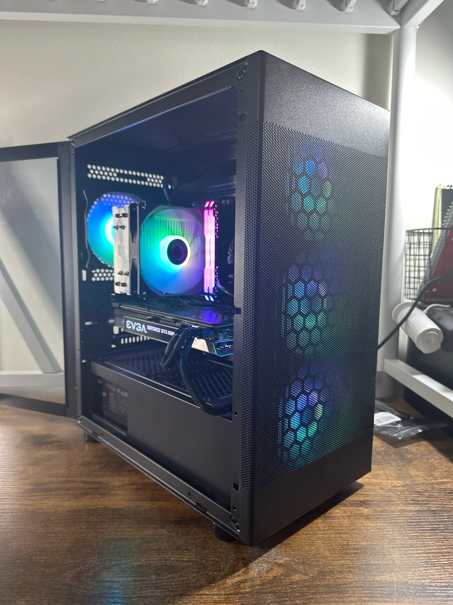

# Pc-Flipping-Portfolio
This repository serves as technical documentation for my hardware flipping business, and will document all sales made by me.

## Where I sell on:
* **Jawa.gg** https://www.jawa.gg/sp/515295/koi-fish-pcs
* **Facebook** https://www.facebook.com/marketplace/profile/100003188611702/
* **OfferUp** https://offerup.com/p/167708603

## Summary Statistics
* **Amount Started With:** $1300
* **Current Net Worth:** $973
* **Total Systems Flipped:** 7
* **Average Profit Margin:** ?

## Project Log: 

### Build #01 (GTX 1080 + i5 10400)
**Specs:** 
Graphics Card ---> Nvidia EVGA Geforce GTX 1080

CPU ---> Intel i5 10400 6 core 8 thread Processor

Motherboard ---> MSI H510M-B

Memory ---> Corsair Vengeance RGB Pro 16GB DDR4 3200 mhz

Storage ---> Patriot 1TB M.2 SSD NVME

Power Supply ---> EVGA BR 500w

Case - DIYPC ARGB-G5-BK

* **Cost:** $429
* **Price sold for:** $455
* **Profit:** $26
* **Details:** This was my very first build I made. I bought all the parts seperately and then assembled them all together. This computer orginally had an i3 10100F but then was replaced with an i5 10400 in my personal PC to sell quicker. Althought the profits weren't the best, I got valuable learning experience from it.
* **Things Learned:** 1. How to build a PC  2. How to find deals  3. Parts that look appealing to buyers and parts that don't
* **Photos:** 
________________________________________
### Build #02 (RTX 3080 + Ryzen 7 5800X)
**Specs:** 
CPU: Ryzen 7 5800X

GPU: Gigabyte Eagle RTX 3080

RAM: ADATA 32GB 3600MT/S DDR4

Storage: 1TB Inland Premium NVME SSD

Motherboard: Gigabyte Vision D-P B550M

CPU Cooler: Thermalright Aqua Elite 360 V6

Power Supply: EVGA SUPERNOVA 750W G+

Case: XPG Invader X ATX

* **Sold On:** Jawa.gg
* **Cost:** $790
* **Price sold for:** $920
* **Profit:** $130
* **Details:** This PC was my first PC that used an already prebuilt PC and upgraded that PC. The original pc had an GTX 1080, but I replaced it with an RTX 3080 because the gpu was bottlenecking the CPU. I don't have the GTX 1080 anymore because I gave it away as a birthday present. I also upgraded the case and cooler, so if you include the cost of the RTX 3080, the total cost of the upgrades is $385. Although after upgrading the case, I sold the old case and the pcie extender that came with the case for a total of $20.
* **Things Learned:** 1. A good price to buy an rtx 3080 is around $300 2. Buying a whole PC and then reselling is a lot easier than scavenging for each part seperately
* **Photos:** 
________________________________________
### Build #06 (RTX 3070 + Ryzen 5 5600X)
**Specs:** 
CPU: Ryzen 5 5600X 6 cores 12 threads

GPU: EVGA RTX 3070 XC3 8GB GDDR6

MOBO:  ASUS B450M

RAM: T-Force Vulcan Z 16gb 3000mhz DDR4 

Storage: 512gb m.2 nvme ssd

Cooler: Black air cooler

PSU: 750W Gold Seasonic

Case: Aura case
* **Cost:** $650
* **Price sold for:** $700
* **Profit:** $50
* **Details:** Originally bought a PC that had everything inside of this pc except instead of an RTX 3070, it had an RTX 3080. I replaced the RTX 3080 with the RTX 3070 that was in a different PC that I bought (Build #7), and valued this pc to cost me $650.
* **Photos:** 
