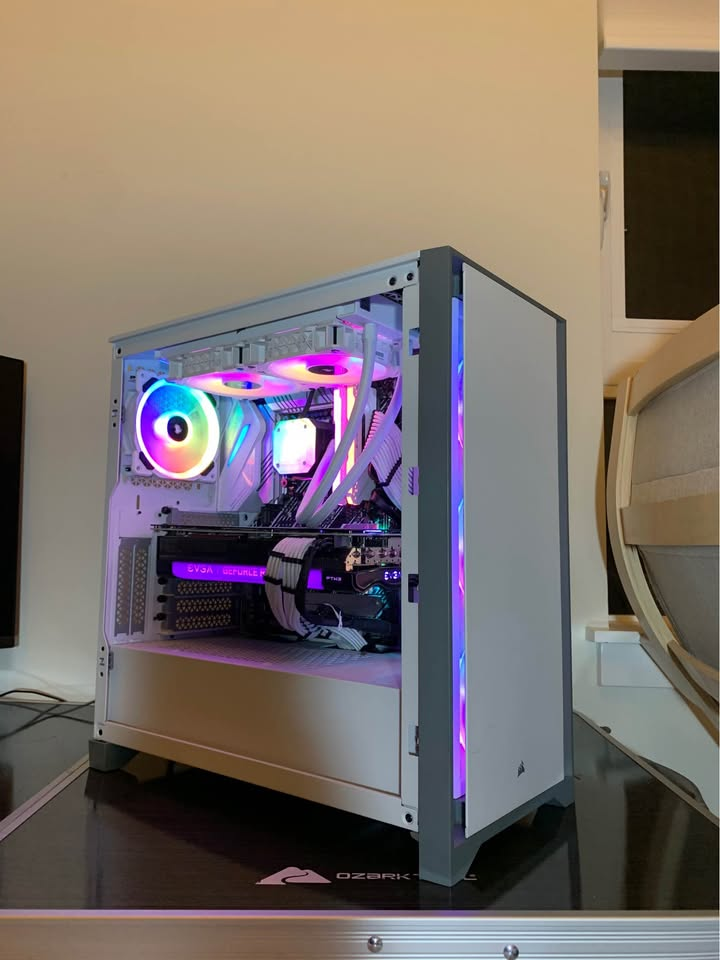
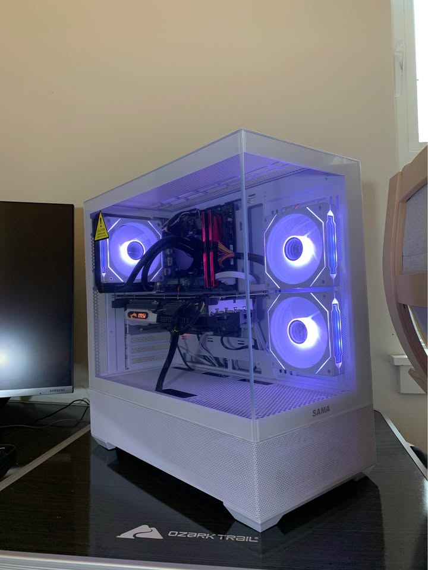

# Sales History
[🏠 Home](README.md) | [💰 Sales History](sales.md) | [📦 Current Inventory](inventory.md) 

________________________________________
### Build #06 (RTX 3070 + Ryzen 5 5600X)
**Specs:** 
CPU: Ryzen 5 5600X 6 cores 12 threads

GPU: EVGA RTX 3070 XC3 8GB GDDR6

MOBO:  ASUS B450M

RAM: T-Force Vulcan Z 16gb 3000mhz DDR4 

Storage: 512gb m.2 nvme ssd

Cooler: Black air cooler

PSU: 750W Gold Seasonic

Case: Aura case

* **Sold On:** Offerup
* **Cost:** $650
* **Price sold for:** $700
* **Profit:** $50
* **Details:** Originally bought a PC that had everything inside of this pc except instead of an RTX 3070, it had an RTX 3080. I replaced the RTX 3080 with the RTX 3070 that was in a different PC that I bought (Build #7), and valued this pc to cost me $650.
* **Photos:** 
_____________________________________________
### Build #05 (RTX 3080 + i7 10700K) 2/26
**Specs:** 
CPU: i7 10700k 8 Core / 16 Threads

GPU: EVGA RTX 3080 FTW3 10GB

MOBO:  ASUS Z590

RAM: 16gb Corsair RGB

Storage: 1tb m.2 nvme ssd

Cooler: Corsair AIO 

PSU: Corsair 850W

Case: Corsair case

* **Sold On:** Facebook Marketplace
* **Cost:** $700
* **Price sold for:** 850
* **Profit:** $150
* **Details:** I bought this PC on offerup at a really good deal, but it was a really dirty. All I did to it was clean it as best as I could then I relisted it. I did not take out any parts at all, and this was probably the easiest sale I made at the time.
* **Things Learned:** <b>1.</b> You don't always have to upgrade or replace parts, you can just relist it without changing anything
* **Photos:** 
_____________________________________________
### Build #04 (GTX 1060 + Ryzen 5 1500X) 2/26
**Specs:** 
CPU: Ryzen 5 1500X

GPU: GTX 1060

MOBO: Asus b350M gaming pro

MEMORY: 16gb 2400 mt/s DDR4

STORAGE: 512gb samsung sata ssd

COOLING: AIO cooler

PSU: Corsair CX750W

CASE: Zalman case

* **Sold On:** Facebook Marketplace
* **Cost:** $175 - $40 (16gb-2666) + $30 (16gb-2400) - $60 (1tb ssd) + $30 (512gb ssd) = <b>$135</b>
* **Price sold for:** $225
* **Profit:** $90
* **Details:** This is the weakest PC that I built at the time, and I mainly bought it to downgrade some parts and store the better parts away for future uses. I replaced the ram kit to a weaker one and a downgraded the storage down to only 512gb. The main selling point of this build is that it was very upgradable, being on the am4 platform and having 750W. This was also the first PC I bought on Offerup.
* **Things Learned:** <b>1.</b> You can buy Pc's on Offerup too <b>2.</b> Downgrading parts than reselling for profit is really effective
* **Photos:** 
________________________________________
### Build #04 (RTX 2070 + i7 8700) 2/26
**Specs:** 
CPU: Intel Core i7-8700

GPU: MSI RTX 2070 8GB 

RAM: 16GB DDR4 2400MT/s (2x8GB)

Storage: 1TB Western Digital SATA SSD

Motherboard: ASUS B360M-A (mATX)

CPU Cooler: AIO Liquid Cooler

Power Supply: Thermaltake Smart 600W

Case: SAMA SV02

* **Sold On:** Facebook Marketplace
* **Cost:** $400 + $60 (case) - $30 (16gb-2400) - $10 (case) + $20 (worker pay) = <b>$440</b>
* **Price sold for:** $510
* **Profit:** $70
* **Details:** This PC was made by buying a PC on facebook marketplace then upgrading the case to sell back online. I tried testing out trying to pay a friend to work with me, which I didn't regret entirely. The original PC had 32gb of ram, which I took out 16gb for a future build.
* **Things Learned:** <b>1.</b> You're not required to use all the parts that came with the original PC <b>2.</b> Only hire people for hard jobs
* **Photos:** 
_____________________________________________
### Build #02 (RTX 3080 + Ryzen 7 5800X) 1/26
**Specs:** 
CPU: Ryzen 7 5800X

GPU: Gigabyte Eagle RTX 3080

RAM: ADATA 32GB 3600MT/S DDR4

Storage: 1TB Inland Premium NVME SSD

Motherboard: Gigabyte Vision D-P B550M

CPU Cooler: Thermalright Aqua Elite 360 V6

Power Supply: EVGA SUPERNOVA 750W G+

Case: XPG Invader X ATX

* **Sold On:** Jawa.gg
* **Cost:** $790 - $10 (case) - $10 (pcie extender) - $20 (Arctic Liquid Freezer II) - $30 (512gb sata ssd)= <b>$720</b>
* **Price sold for:** $920
* **Profit:** $200
* **Details:** This PC was my first PC that used an already prebuilt PC and upgraded that PC. The original pc had an GTX 1080, but I replaced it with an RTX 3080 because the gpu was bottlenecking the CPU. I don't have the GTX 1080 anymore because I gave it away as a birthday present. I also upgraded the case and cooler, so if you include the cost of the RTX 3080, the total cost of the upgrades is $385. Although after upgrading the case, I sold the old case and the pcie extender that came with the case for a total of $20 and I kept the old cooler for future uses. There was also an extra 512gb ssd which I took out too.
* **Things Learned:** 1. A good price to buy an rtx 3080 is around $300 2. Buying a whole PC and then reselling is a lot easier than scavenging for each part seperately
* **Photos:** 
________________________________________
### Build #01 (GTX 1080 + i5 10400) 9/25
**Specs:** 
Graphics Card ---> Nvidia EVGA Geforce GTX 1080

CPU ---> Intel i5 10400 6 core 8 thread Processor

Motherboard ---> MSI H510M-B

Memory ---> Corsair Vengeance RGB Pro 16GB DDR4 3200 mhz

Storage ---> Patriot 1TB M.2 SSD NVME

Power Supply ---> EVGA BR 500w

Case - DIYPC ARGB-G5-BK

* **Sold On:** Jawa.gg
* **Cost:** $429
* **Price sold for:** $455
* **Profit:** $26
* **Details:** This was my very first build I made. I bought all the parts seperately and then assembled them all together. This computer orginally had an i3 10100F but then was replaced with an i5 10400 in my personal PC to sell quicker. Althought the profits weren't the best, I got valuable learning experience from it.
* **Things Learned:** <b>1.</b> How to build a PC  <b>2.</b> How to find deals  <b>3.</b> Parts that look appealing to buyers and parts that don't
* **Photos:** 
